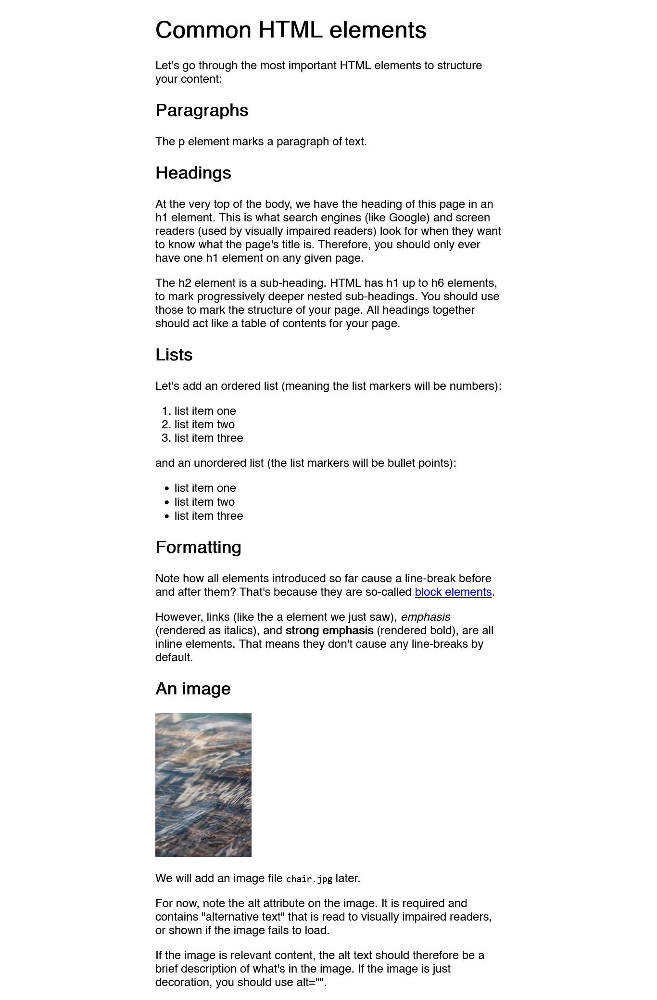

# mastro_eval

This is a basic TypeScript template for [Mastro](https://mastrojs.github.io) when using [Deno](https://deno.com/).

## Run locally

`deno task dev`

## Learn more

To see how the Mastro web framework works, [follow the guide](https://mastrojs.github.io/guide/multiple-pages-with-shared-components/).

## Deploy to production

[Join Deno DeployEA](https://docs.deno.com/deploy/early-access/) (Early Access) and set up a [new app](https://app.deno.com/mastrojs/~/new) with the following build configuration:

- Framework preset: No Preset
- Install command: `deno install`
- Build command: blank
- Dynamic App -> Entrypoint: `server.ts`

### Credits

* [Mastro Guide](https://mastrojs.github.io/guide/server-side-components-and-routing)
